# Мобильное приложение "Простой английский"

Данный репозиторий содержит в себе клиентскую часть клиент-серверного приложения для изучения английского языка. Приложение позволяет обучаться как с помощью классических методов, вроде изучения теории, лексических упражнений и аудирования, так и с помощью прогрессивных методов - запоминания, основанного на кривой запоминания Эббингаузера и чтения по методике Ильи Франка.

__На данный момент разработан минимальный функционал приложения, корректно исполняющий свои функции. В будущем приложение, возможно, будет адаптировано под большую аудиторию, а также будет добавлено множество новых возможностей__

Ниже приведено несколько примеров работы приложения

## Авторизация/регистрация/восстановление пароля

<table>
    <row>
        <cell>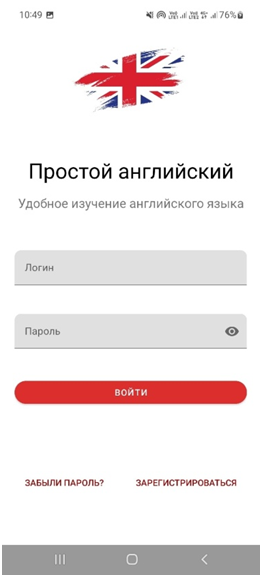</cell>
        <cell>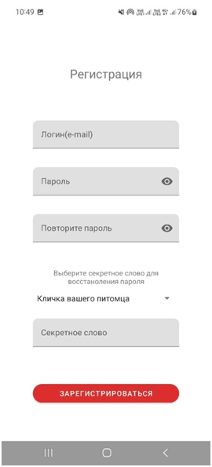</cell>
        <cell>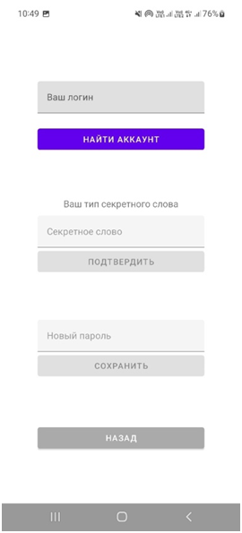</cell>
    </row>
</table>

## Главное меню

<table>
    <row>
        <cell>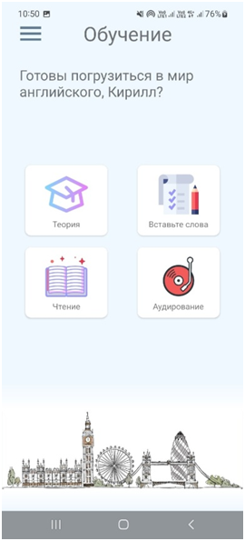</cell>
        <cell></cell>
    </row>
</table>

## Статистика и переводчик

<table>
    <row>
        <cell>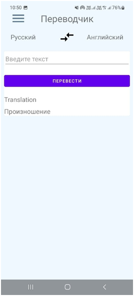</cell>
        <cell>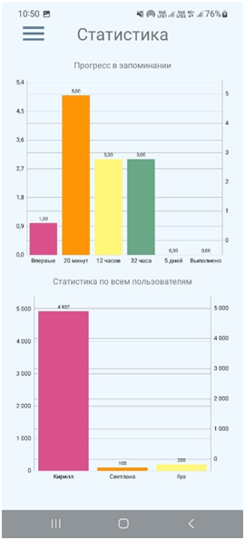</cell>
    </row>
</table>

## Запоминание слов

<table>
    <row>
        <cell>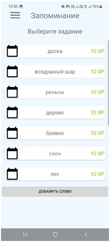</cell>
        <cell>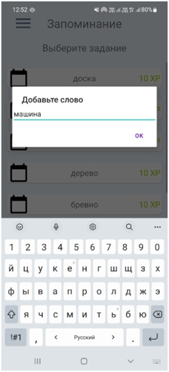</cell>
        <cell>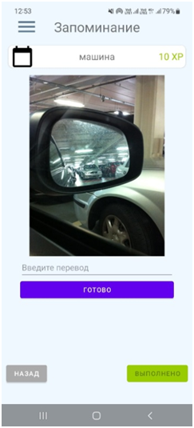</cell>
    </row>
</table>

## Примеры классического обучения

<table>
    <row>
        <cell>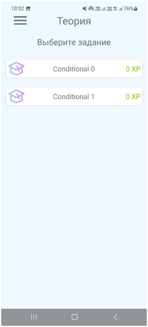</cell>
        <cell>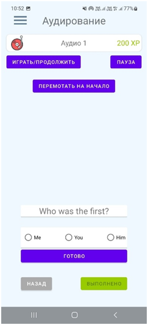</cell>
    </row>
</table>

## Настройки

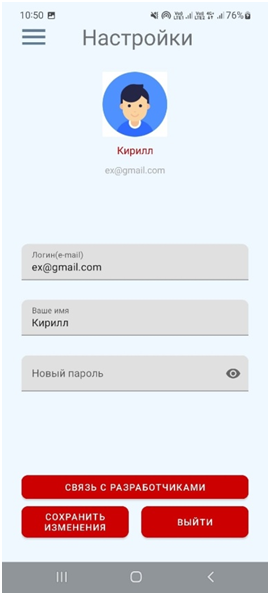

